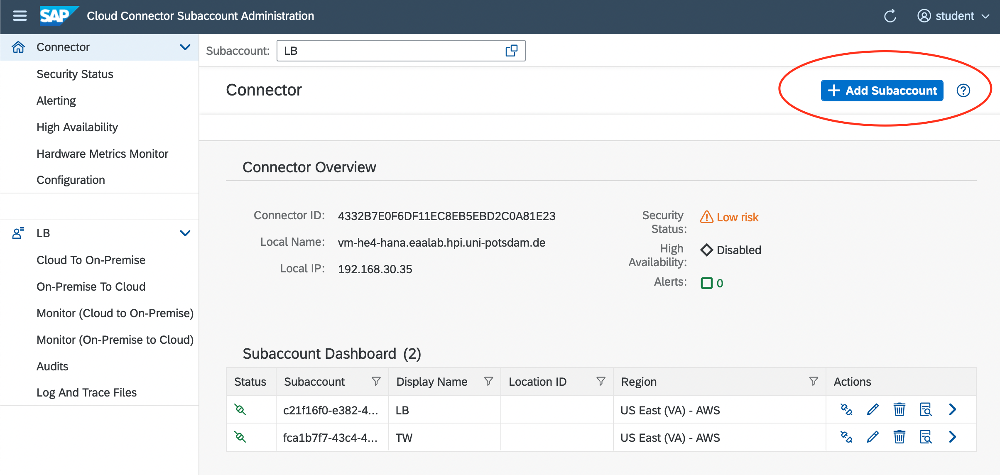
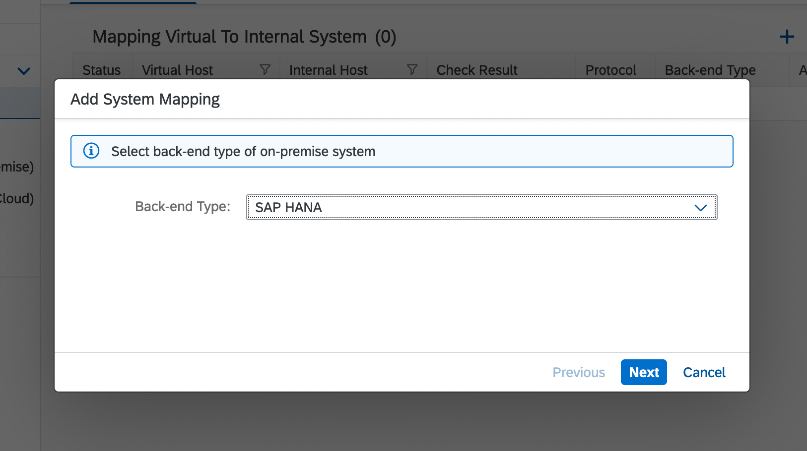
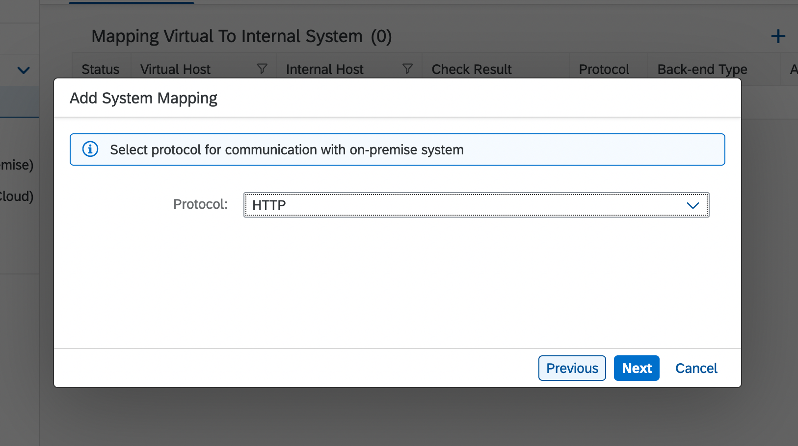
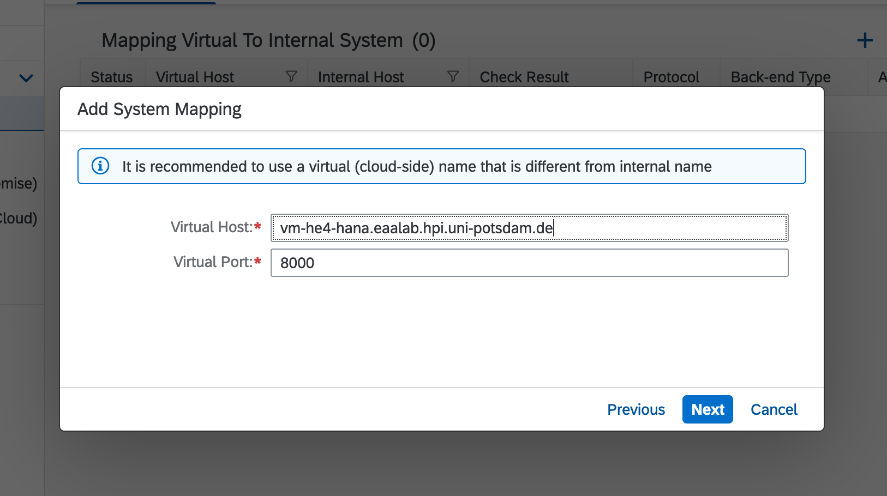
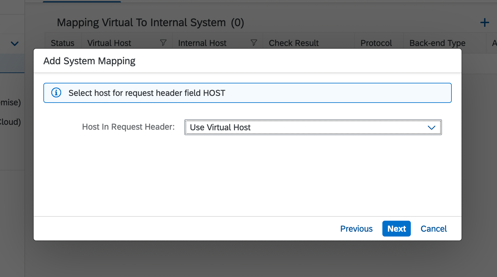
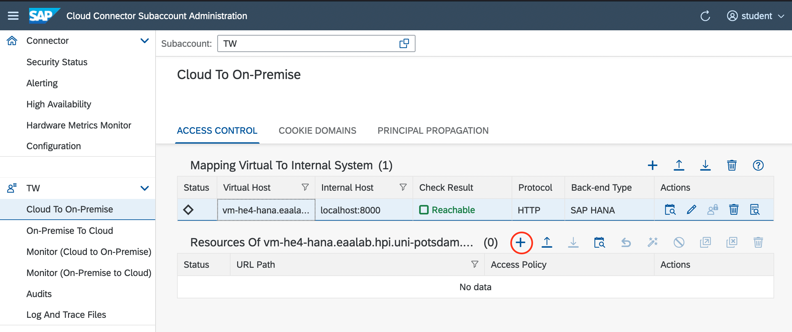
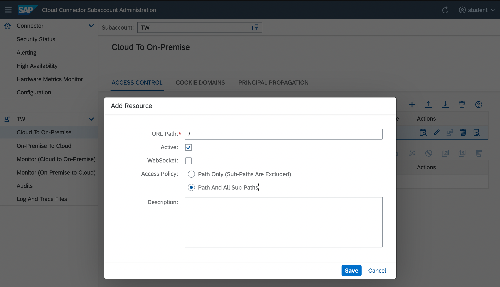
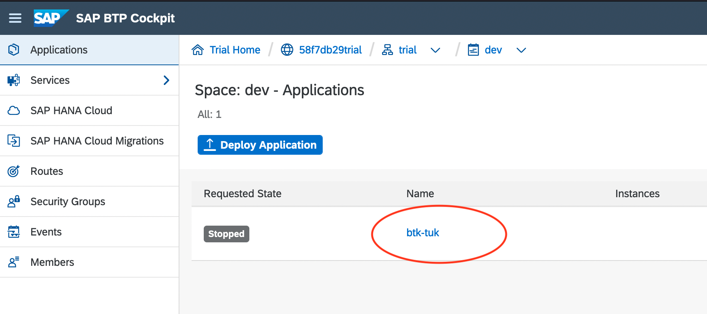
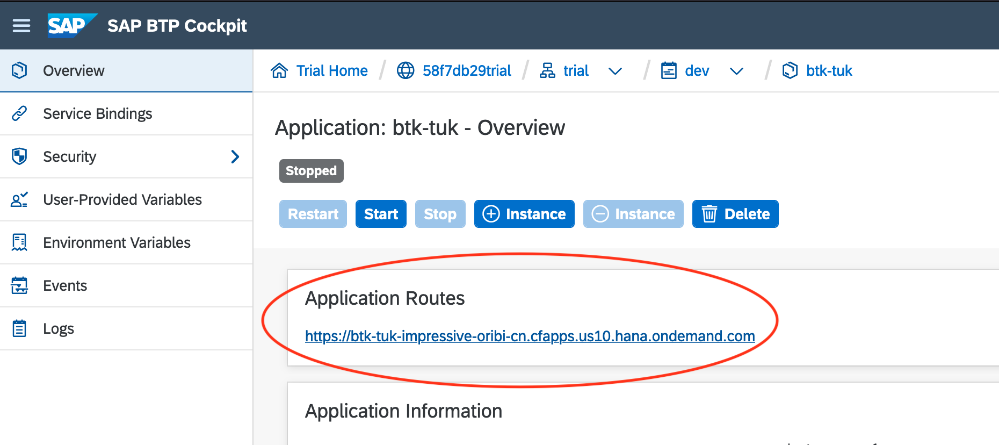

# BTP Exercise

## Goal of the Exercise

This exercise should give a first impression about cloud platforms using the example of the SAP business technology platform (BTP). The SAP BTP is a Platform as a Service (PaaS) offering by SAP that helps you to connect to connect data and business processes of your enterprise. The goal of this exercise is to show you basic functionalities of the SAP BTP prior to our block week.

> Note: We only use the SAP BTP as an example for cloud platforms. Other cloud platforms such as Google Platform, Microsoft Azure and Amazon AWS are also capable to enhance businesses.

## Exercise

Many enterprises use a hybrid setup using on-premise and cloud-based software simultaneously. Applications deployed in the cloud often access data persisted in the on-premise systems of a company. Imagine HPI's purchasing department wants to create a cloud application to visualize how much money spend with every vendor, extending the functionality of their ERP system by using the SAP BTP.

In this exercise, we deploy a small application to a cloud platform that requests data from an on-premise SAP HANA instance. The instance is located at the HPI and (normally) only accessible within the network or via a VPN. You will learn how to deploy an application to the SAP BTP, which uses data relying on an on-premise SAP HANA database.

Most cloud applications consist of multiple microservices. The architecture of our exercise is divided into two parts: first, services and applications replying at the HPI, and second your applications deployed on the SAP BTP.


In the following, we briefly describe the functionality of each application/ service of the exercise architecture. 

**HPI1: SAP HANA** The SAP HANA is an in-memory database developed by SAP. The SAP HANA is hosted at ``vm-reset.eaalab.hpi.uni-potsdam.de``. The SAP HANA stores multiple tables from the ERP S/4HANA which should be familier to you from exercise 1. For this exercise, instead of querying the database via TCP, we use an so called OData Service to access data via HTTP.

**HPI2: OData Service**  An OData Service is a RESTful API which follows the [Open Data Protocol standard](https://www.odata.org/). The standard exists in multiple versions, however we use OData version 2. For you convience, the OData Service is already implemented as a so called XS Service directly on the SAP HANA. The API is accesasable via ``http://vm-he4-hana.eaalab.hpi.uni-potsdam.de:8000/odataservice/hello.xsodata/VBAK/?$format=json``.

**HPI3: SAP Cloud Connector**
[SAP Cloud Connector (SCC)](https://help.sap.com/docs/CP_CONNECTIVITY/cca91383641e40ffbe03bdc78f00f681/e6c7616abb5710148cfcf3e75d96d596.html) is a software that connects the SAP BTP and existing on-premise systems. We already deployed one instance on the same machine as our SAP HANA. In course of this exercise, you will connect your SAP BTP subaccount to the SCC in order to access the HPI on-premise SAP HANA. The SCC is accessible ``https://vm-he4-hana.eaalab.hpi.uni-potsdam.de:8443/``.

**BTP1: SvelteKit Application**
[SvelteKit](https://kit.svelte.dev/) is a framework for building web applications. You will use it to develop an application that queries data from the on-premise SAP HANA and deploy it to the SAP BTP.

**BTP2: Destination Service**
The Destination service lets you retrieve the backend destination details you need to configure applications in SAP BTP's Cloud Foundry environment.

**BTP3: Connectivity Service**
SAP BTP's Connectivity service allows you to establish secure and reliable connectivity between your cloud applications and on-premise systems running in isolated networks.

In this exercise, we create two services (provided by SAP) and one application (that you have to program) on the SAP BTP. 

### Prerequisites
To work on the excersie you need:

- [Node 16 including NPM](https://nodejs.org/en/download/)
- [Git](https://git-scm.com/)
- Editor (we recommend [Visual Studio Code](https://code.visualstudio.com/))
- A phone number (for the SAP BTP account creation)

### Account creation

Before we can create services on the cloud platform, we have to create a free account on the SAP BTP.  

0. In case you do not have a SAP BTP Account: Please [register](https://www.sap.com/products/business-technology-platform/trial.html?trial=https%3A%2F%2Fwww.sap.com%2Fregistration%2Ftrial.908cb719-0e03-421c-a091-daca045f0acc.html) for a free trail account.
1. [Login](https://account.hana.ondemand.com/) into an account for the SAP BTP (You can skip the process of validating your phone number)
2. Select *US East (VA) - AWS* as region for our trail account.
3. Wait until your account was fully created. 
4. Click on *Go To Your Trial Account*.

### CLI Installation

In most cases you'll use the command line tool if you interact with cloud platforms since it is way faster than using the UI of the BTP, AWS, Google Platform or Azure.
The BTP uses [cloud foundry](https://www.cloudfoundry.org/) to deploy applications.

1. Follow the [instructions](https://github.com/cloudfoundry/cli/wiki/V8-CLI-Installation-Guide)
2. Open your terminal and execute following command to login into our account. You can find the API endpoint in your trial account in section *Cloud Foundry Environment*.
    
    ````
    > cf login
    API endpoint: https://api.cf.us10.hana.ondemand.com
    Email: <your account mail>
    Password: <your pw>
    ````

### Create Connectivity Service
In order to access the SAP HANA DB using the SAP Cloud Connector hosted at our research group, you need to create an instance of BTP's *Connectivity Service*.
1. After cklicking on *Go To Your Trial Account*, you have to enter your subaccount:
    
2. Here you can use the navigation bar to open the *Service Marketplace*:
    
3. Search for *Connectivity Service* and click on *Create*:
    
<!-- TODO: change screenshot -->
4. Follow the setup (you don't have to enter parameters):
    
5. Check the status under *Instances* (status should be *created* after a few moments):
    
6. Voilà!

### Connect Your BTP Account To The On-prom Cloud Connector
As described above, we use the [SCC](https://blogs.sap.com/2022/02/03/cloud-connector-explained-in-simple-terms/) to enable SAP cloud products to connect to the on-premise systems in our own landscape. It basically tunnels the requests.

Please follow these steps to configure the SCC to connect your SAP BTP account:

>Please note that you all share one instance since the SAP Cloud Connector does not support proper user management. Do not delete the subaccounts of your fellow students! We will find you!

1. The instance running at EPIC is available [here](https://vm-he4-hana.eaalab.hpi.uni-potsdam.de:8443/). Please open it and use the following credentials to log in:
    ````
    User Name:  student
    Password:   Student2022
    ````
2. Add your BTP subaccount to the SAP Cloud Connector:
    1. Switch to the [BTP](https://account.hanatrial.ondemand.com): Click on your subaccount:
    
    2. Copy your subaccount ID:
    
    3. Back to the SAP Cloud Connector: Click add subaccount:
    
    4. Use your BTP credentials to log in:
    
    5. Switch to your own subaccount:
    
    6. Connect the on-premise HANA to the cloud by providing a mapping from the virtual host (vm-he4-hana.eaalab.hpi.uni-potsdam.de) to the internal host (localhost):
    
    Back-end type: ````SAP HANA````
    
    Protocol: ````HTTP````
    
    Internal host: ````localhost````, internal port: ````8000````
    
    Virtual host: ````vm-he4-hana.eaalab.hpi.uni-potsdam.de````, virtual port: ````8000````
    
    Principal type: ````None````
    
    Host In Request Header: ````Use Virtual Host````
    
    Description: ````<optional>````
    
    Click the *Check Internal Host* checkbox:
    
    Click on the newly created entry and press the *+* button: 
    
    Add the corresponding ressources by adding the URL path ``/`` and save:
    
    Back on the SAP BTP, you should now see our SAP HANA under *Cloud Connectors*:
        
3. You did it! We can leave the SCC now and start building our app.

### GitHub Clone

For your convenience, we prepared a small [Svelte](https://svelte.dev/) application using [SvelteKit](https://kit.svelte.dev/). (You do not need to understand what Svelte is doing, however it is a cool framework for frontend development) Clone the project via git clone and install the dependencies.

````
> git clone <TODO>
> npm install
````

TODO CREATE .env.development

### Deploy Your Application
To deploy your application, you need to create a ``manifest.yml`` file in your project's root folder as described [here](https://docs.cloudfoundry.org/devguide/deploy-apps/manifest.html):


```yaml
applications:
  - name: btk-tuk
    path: ./
    buildpacks:
      - nodejs_buildpack
    memory: 256M
    command: node dist/index.js
    random-route: true
    services:
      - <your connectivity service>
```

Our app requires two environment variables to connect to our on-premises SAP HANA: username and password to access the ODataService.  With the following two commands you can add the two environment variables to our cloud application.

```shell
> cf set-env btk-tuk VITE_ODATA_HPI_HANA_USERNAME STUDENT2021
> cf set-env btk-tuk VITE_ODATA_HPI_HANA_PASSWORD Student2021
```

The following commands can be executed to build the app and push it to the BTP:
```shell
> npm run build
> cf push
```
In your Cloud Foundry spaces, you can find your deployed applications and access them:




### Optional: Clean-up 
- delete account
- delete cli

### TODO (from https://answers.sap.com/questions/13222105/use-nodejs.html)
- Credential store ?
- connectivity service
- destination service
