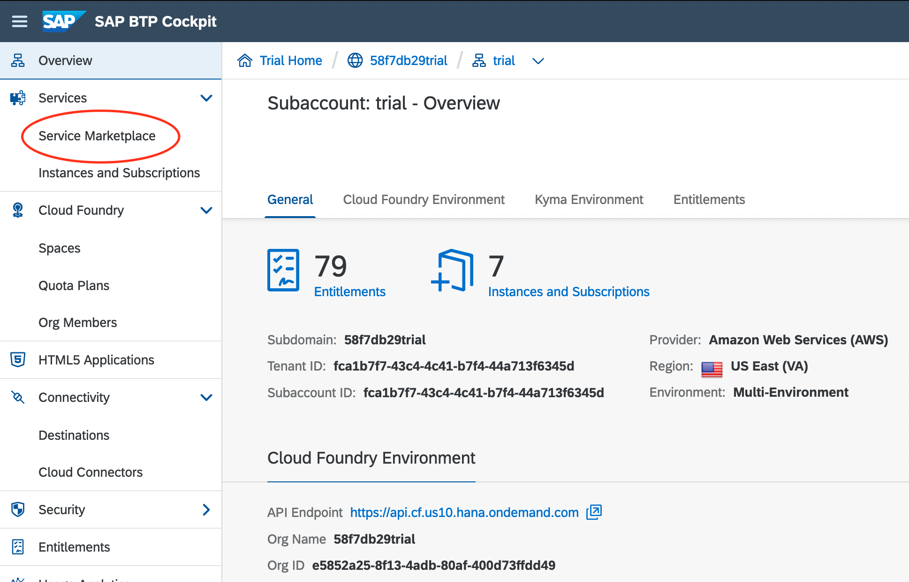
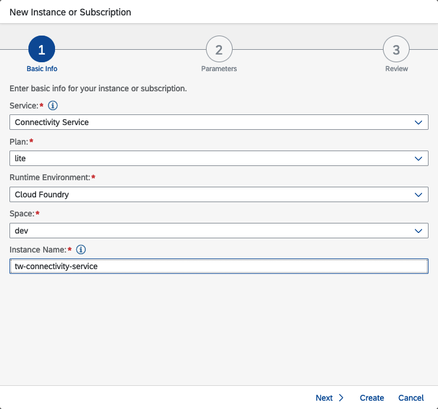
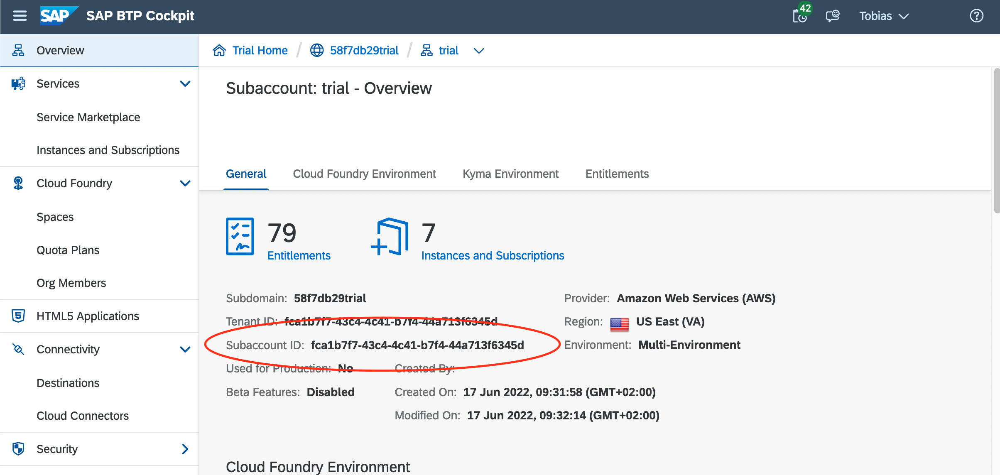

# BTP Exercise
## Goal of the Exercise

This exercise should guide you through the SAP business technology platform (BTP). The goal of the exercise is to give you an impression of cloud platforms based on the example of the BTP.

## Exercise

Many enterprises use a hybrid setup using on-premise and cloud-based software simultaneously. In this exercise, we deploy a small application to a cloud platform that requests data from an on-premise SAP HANA instance. The instance is located at the HPI and (normally) only accessible within the network or via a VPN. In this exercise, you will experience how to deploy an application to the cloud which uses data relying on an on-premise SAP HANA database. As cloud platform we use the SAP Business Technologie Platform (BTP) for this exercise. However, other cloud platforms such as Google Cloud Platform, Microsoft Azure, or Amazon AWS can.

### Prerequisites

- [Node 16 including NPM](https://nodejs.org/en/download/)
- [Git](https://git-scm.com/)

### Architecture

The architecture of our exercise is divided into two parts: first, services and applications replying at the HPI, and second your applications deployed on the SAP BTP.


We already prepared applications deployed at the HPI for you (HPI1 - HPI3). 

*HPI1 SAP HANA* The SAP HANA is an in-memory database developed by SAP. For this exercise the SAP HANA stores multiple tables from the ERP S/4 HANA which should be familier to you from exercise 1. For this exercise, we do not query the database via TCP, but use an so called OData Service to access data via HTTP.

*HPI2 OData Service*

*HPI3 Cloud Connector*

Most cloud applications consist of multiple microservices. In this exercise, we create two services and one application on the SAP BTP. 

### Account creation

Before we can create services on the cloud platform, we have to create a free account on the SAP BTP.  

0. In case you do not have an SAP BTP Account: Please [register](https://www.sap.com/products/business-technology-platform/trial.html?trial=https%3A%2F%2Fwww.sap.com%2Fregistration%2Ftrial.908cb719-0e03-421c-a091-daca045f0acc.html) for a free trail account.
1. [Login](https://account.hana.ondemand.com/) into an account for the SAP BTP (You can skip the process of validating your phone number)
2. Select US East (VA) - AWS as region for our trail account.
3. Wait until your account was fully created. 
4. Click on *Go To Your Trial Account*.

### CLI Installation

In most cases you'll use the command line tool if you interact with cloud platforms since it is way faster than using the UI of the BTP, AWS, Google Platform or Azure.
The BTP uses [cloud foundry](https://www.cloudfoundry.org/) to deploy applications.

1. Follow the [instructions](https://github.com/cloudfoundry/cli/wiki/V8-CLI-Installation-Guide)
2. Open your terminal and execute following command to login into our account. You can find the API endpoint in your trial account in section *Cloud Foundry Environment*.
    
    ````
    > cf login
    API endpoint: https://api.cf.us10.hana.ondemand.com
    Email: <your account mail>
    Password: <your pw>
    ````

### Create Connectivity Service
In order to access the SAP HANA DB using the SAP Cloud Connector hosted at our research group, you need to create an instance of BTP's *Connectivity Service*.
1. After cklicking on *Go To Your Trial Account*, you have to enter your subaccount:
    
2. Here you can use the navigation bar to open the *Service Marketplace*:
    
3. Search for *Connectivity Service* and click on *Create*:
    
4. Follow the setup (you don't have to enter parameters):
    
5. Check the status under *Instances* (should be *created*):
    
6. Voilà!

### Connect Your BTP Account To The On-prom Cloud Connector
As described above, we use the [SAP Cloud Connector](https://blogs.sap.com/2022/02/03/cloud-connector-explained-in-simple-terms/) to enable SAP cloud products to connect to the on-premise systems in our own landscape. It basically tunnels the requests.

Please follow these steps to configure the SAP Cloud Connector to connect your SAP BTP account:

**Please note that you all share one instance since the SAP Cloud Connector does not support proper user management. Do not delete the subaccounts of your fellow students! We will find you!** 

1. The instance running at EPIC is available [here](https://vm-he4-hana.eaalab.hpi.uni-potsdam.de:8443/). Please open it and use the following credentials to log in:
    ````
    User Name:  student
    Password:   Student2022
    ````
2. Add your BTP subaccount to the SAP Cloud Connector:
    1. Switch to the [BTP](https://account.hanatrial.ondemand.com): Click on your subaccount:
    
    2. Copy your subaccount ID:
    
    3. Back to the SAP Cloud Connector: Click add subaccount:
    
    4. Use your BTP credentials to log in:
    
    5. Switch to your own subaccount:
    
    6. Connect the on-premise HANA to the cloud by providing a mapping from the virtual host (vm-he4-hana.eaalab.hpi.uni-potsdam.de) to the internal host (localhost):

### GitHub Clone

For your convenience, we prepared a small [Svelte](https://svelte.dev/) application using [SvelteKit](https://kit.svelte.dev/). (You do not need to understand what Svelte is doing, however it is a cool framework for frontend development) Clone the project via g

````
> cf login
API endpoint: https://api.cf.us10.hana.ondemand.com
Email: <your account mail>
Password: <your pw>
````

### Deploy Your Application
To deploy your application, 

### Optional: Clean-up 
- delete account
- delete cli

### TODO (from https://answers.sap.com/questions/13222105/use-nodejs.html)
- Credential store ?
- connectivity service
- destination service
